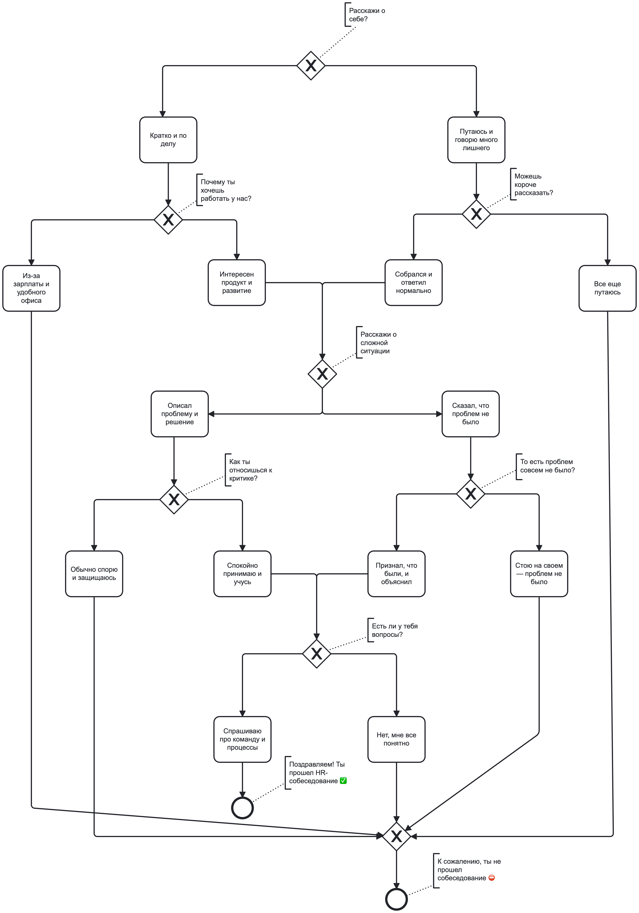

# **Quest Interview (Java Web Application)**

## **1. Описание проекта**

Данное приложение представляет собой веб-квест, моделирующий процесс прохождения HR-собеседования.

Пользователь отвечает на последовательность вопросов в браузере.
Каждый вопрос имеет два варианта ответа, от которых зависит дальнейшее развитие сценария.

В зависимости от выбранных ответов пользователь приходит к одному из двух результатов:
- успешное прохождение собеседования
- отказ

Логика переходов между вопросами задаётся во внешнем JSON-файле, что позволяет изменять сценарий без изменения кода.

---

## **2. Технологии и требования**

### Используемые технологии
- Java 17
- Apache Tomcat 10
- Maven
- Jakarta Servlet APIlj,fd
- Jackson 

### Требования для запуска
- JDK 17
- Apache Tomcat 10
- Maven 3.x
- Приложение доступно по адресу: http://localhost:8080/

---

## **3. Архитектура и классы**

### Приложение реализовано с разделением на слои:
- Controller
- Service
- Repository
- Model (Entity)

### **3.1 Controller**

QuestionServlet

Обрабатывает HTTP-запросы от клиента.

### Функции:
- получает id текущего вопроса из запроса
- инициализирует HTTP-сессию
- запрашивает следующий вопрос через сервис
- передаёт данные в JSP
- ведёт счётчик завершённых игр

### **3.2 Service**

QuestionService

Слой бизнес-логики.

**Функции:**
- получение вопроса по идентификатору
- взаимодействие с репозиторием

**Реализация:**
- поиск выполняется перебором массива вопросов

### **3.3 Repository**

GameRepository

Слой доступа к данным.

**Функции:**
- загрузка JSON-файла hr-quest.json
- десериализация в Java-объекты
- хранение данных в памяти

Используется библиотека Jackson (ObjectMapper).

### **3.4 Model**

**Game**
- содержит массив всех вопросов

**Question**
- id — идентификатор вопроса
- text — текст вопроса
- answers — список ответов
- isFinish — признак финального состояния

**Answers**
- id — идентификатор ответа
- text — текст ответа
- idNextQuestion — переход к следующему вопросу

---

## **4. Дерево решений**

Ниже представлена схема переходов между вопросами в зависимости от выбранных ответов.

---

## **5. Тестирование**

В проекте реализовано модульное тестирование с использованием JUnit 5 и Mockito.

Покрытие тестами:

**1. QuestionService**
- получение вопроса по корректному id
- выброс исключения при несуществующем id

**2. QuestionServlet**
- установка текущего вопроса (questionCurrent) в request
- увеличение счётчика завершённых игр (gamesCount) в session при достижении финального состояния